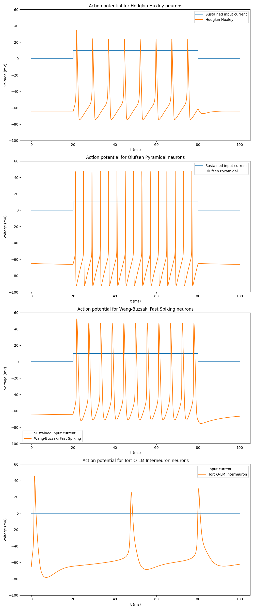
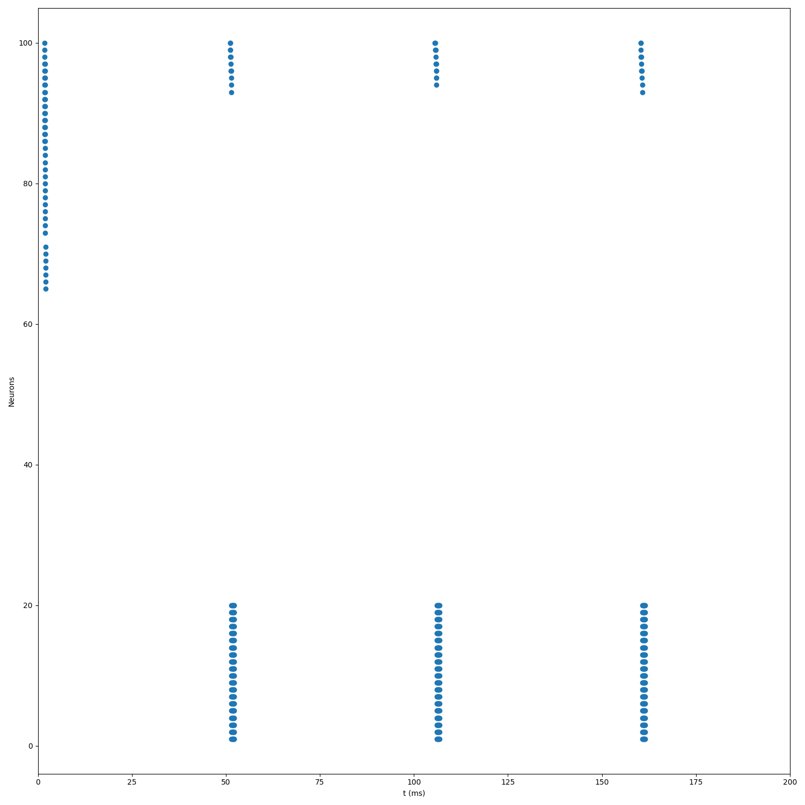
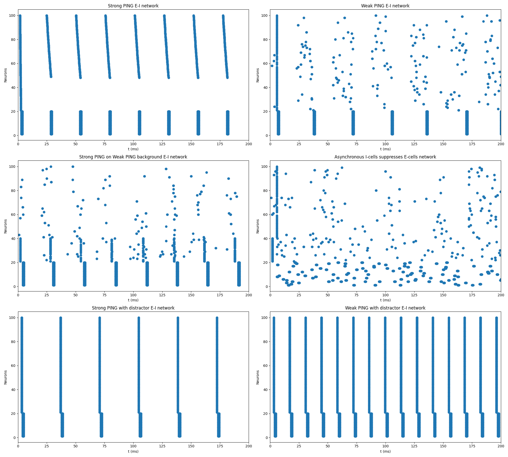

# Instructions
This package assumes you have `numpy` installed.
```
git clone https://github.com/bri25yu/Rhythms-of-the-brain.git
cd Rhythms-of-the-brain
python3 main.py  # or your version of python
```

# Description
We need to numerically approximate a solution to the Hodgkin-Huxley partial differential equation, so we write some approximation methods first, including the Euler, Runge-Kutta order 2 (RK2), and Taylor order 2 approximation methods.


<div style="page-break-after: always;"></div>


We use the previous Euler approximation method to approximate solutions to voltage-clamped experiments and measure the response of the Sodium activation, Sodium inactivation, and Potassium activation.


<div style="page-break-after: always;"></div>


Putting these activation gates together, we can finally model and approximate a solution to an action potential at different starting potentials.


<div style="page-break-after: always;"></div>


We can further model an input current's effect on our action potential model, simulating an artificial example of the output of the presynaptic neuron potential into the current neuron.


<div style="page-break-after: always;"></div>


In order to produce theta and gamma rhythms, we investigate the behavior of several different types of neurons; specifically, we compare the original Hodgkin-Huxley neuron model with the Olufsen Pyramidal neuron, Wang-Buzsaki fast-spiking neuron, and the Tort O-LM interneuron models. 



<div style="page-break-after: always;"></div>


Using 80 Excitatory (pyramidal) and 20 Inhibitory (fast spiking basket) neurons, we can mimic PING rhythms. Neurons 1-20 are I and neurons 21-100 are E. 






