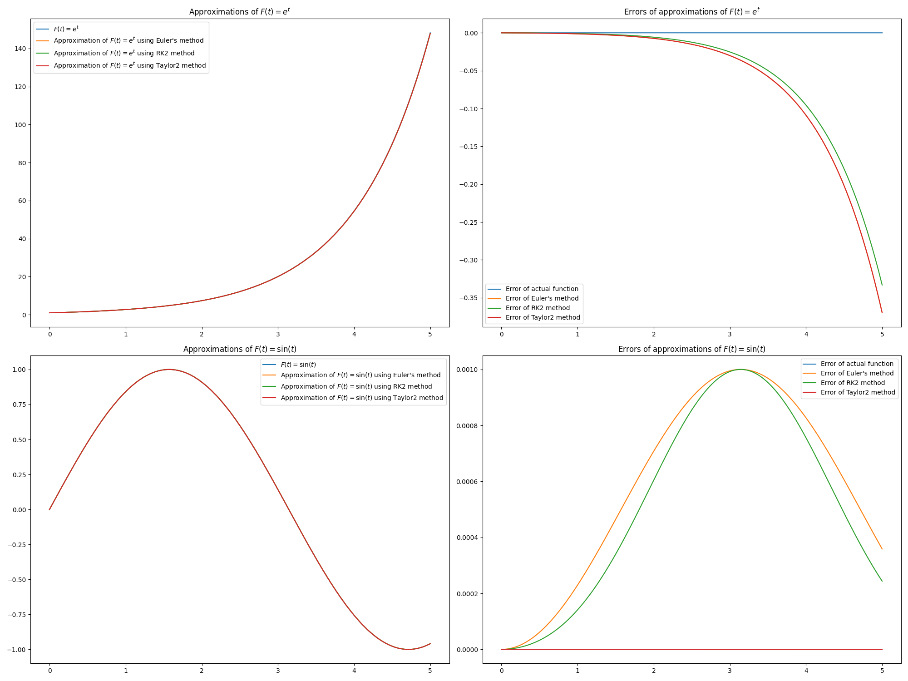
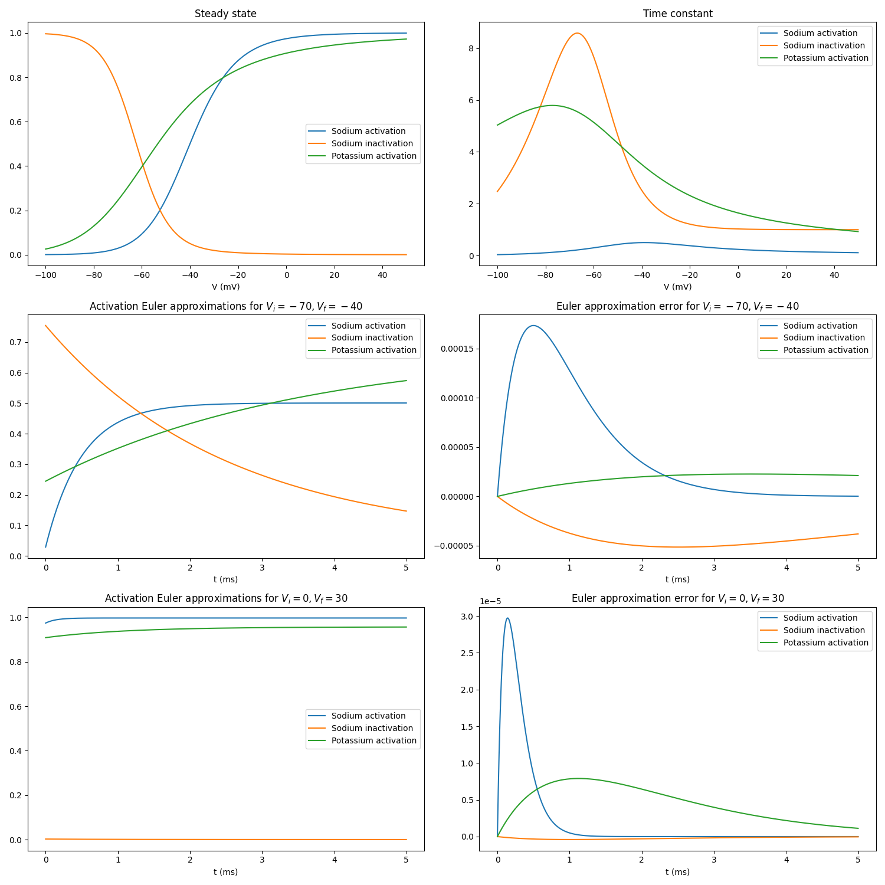
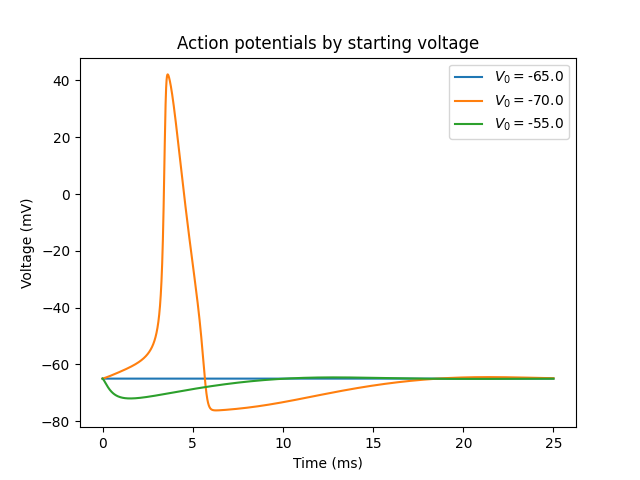
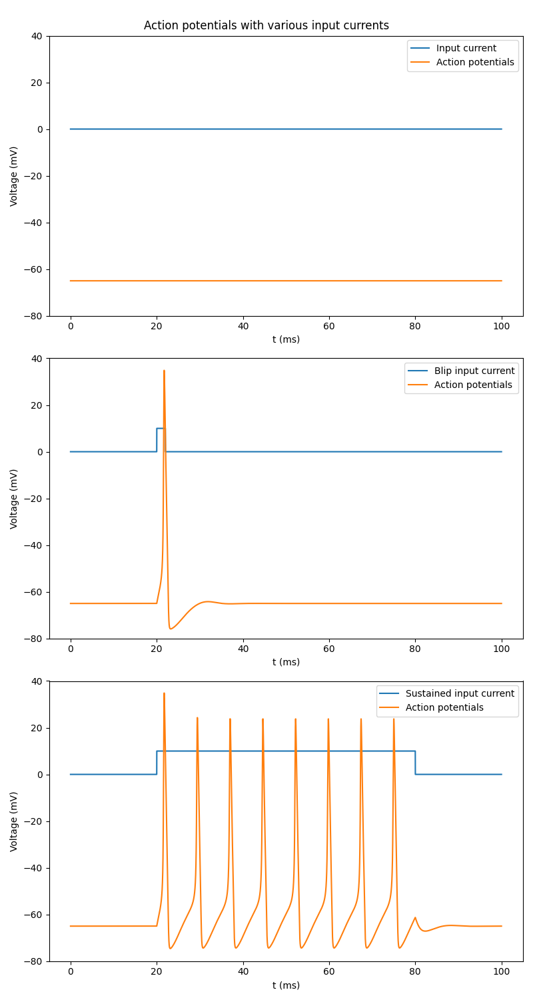

We need to numerically approximate a solution to the Hodgkin-Huxley partial differential equation, so we write some approximation methods first, including the Euler, Runge-Kutta order 2 (RK2), and Taylor order 2 approximation methods.

We use the previous Euler approximation method to approximate solutions to voltage-clamped experiments and measure the response of the Sodium activation, Sodium inactivation, and Potassium activation.

Putting these activation gates together, we can finally model and approximate a solution to an action potential at different starting potentials.

We can further model an input current's effect on our action potential model, simulating an artificial example of the output of the presynaptic neuron potential into the current neuron.

